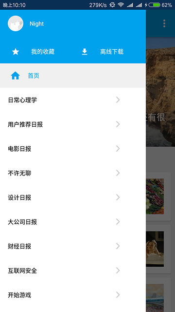

### 知乎日报·今日 AS版

发现 知乎日报·今日的 Eclipse 版有了一些 star ，其他开发者编译代码时需要手动导入 v7 等 jar 包并建立依赖关系，不利于项目的使用，管理和维护。

现在主流做法是使用 Android Studio + Gradle 开发并管理依赖，因此便有了这个项目。

### 简介

像素级高仿知乎日报，可以查看正常日报内容和主题日报内容，支持文章分享和浏览器查看。

使用 Activity 作为容器，首页内容和主题日报等均使用 Fragment，日报的详情页使用 Fragment + WebView 展示。

项目使用 MVP 的架构模式，使用 Retrofit + RxJava 获取日报数据。逻辑操作均放在 Presenter 中执行， Activity 和 Fragment 只是展示模块。所有图片展示使用 [Fresco](http://fresco-cn.org/) 。

自定义启动界面 LogoView ，ViewPagerIndicator ，ViewPagerIndicator 有良好的滑动效果。

适配 Android 4.0 及 5.0 以上的沉浸式状态栏，可以系统 fitSystemWindows 属性，也可以使用项目中自定义的 VirtualStatusBar 。

支持夜间模式切换，代码中对夜间模式切换的多种实现方案进行了注释，也可以参考 [Android 夜间模式切换](http://liandongyang.coding.me/post/android-support-night-mode/) 这篇文章。

   

  

### 依赖库

* [RxAndroid](https://github.com/ReactiveX/RxAndroid)
* [RxJava](https://github.com/ReactiveX/RxJava)
* [Retrofit](https://github.com/square/retrofit)
* [Fresco](http://fresco-cn.org/)

### 参考

* [DecentBanner](https://github.com/chengdazhi/DecentBanner) 参考了其中 indicator 的实现方式，应用到 indicator 中。
* [ZhihuDailyPurify](https://github.com/izzyleung/ZhihuDailyPurify/) 数据来源与 ZhihuDailyPurify 对知乎日报 API 的分析。
* ~~[EasyRecycleAdapterHelper](https://github.com/HotBitmapGG/EasyRecycleAdapterHelper) 加载 RecycleView item 时的动画效果~~弃用这个效果因为会导致 CardView 的 cardElevation 属性消失。
* More 还有很多优秀的 Retrofit ，RxJava 的文章。

### License

Licensed under the Apache License, Version 2.0 (the "License");
you may not use this file except in compliance with the License.
You may obtain a copy of the License at

http://www.apache.org/licenses/LICENSE-2.0

Unless required by applicable law or agreed to in writing, software
distributed under the License is distributed on an "AS IS" BASIS,
WITHOUT WARRANTIES OR CONDITIONS OF ANY KIND, either express or implied.
See the License for the specific language governing permissions and
limitations under the License.